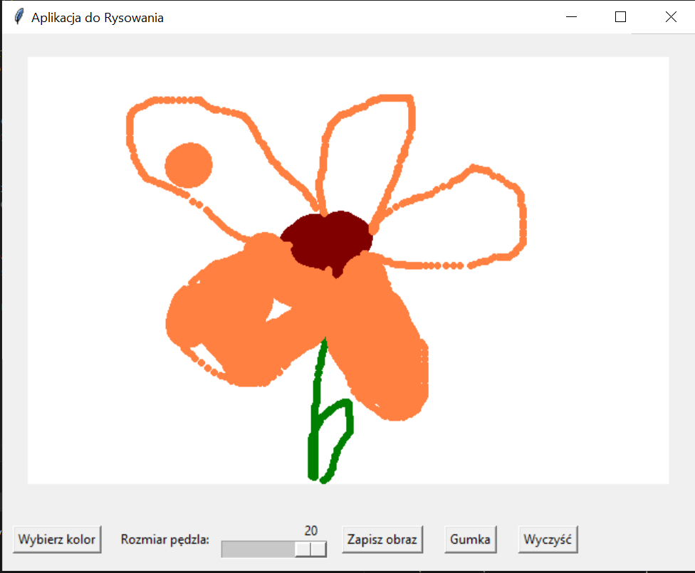

# Aplikacja do Rysowania

## Opis
Aplikacja do rysowania stworzona w Pythonie przy użyciu biblioteki Tkinter. Umożliwia użytkownikom rysowanie na płótnie, wybieranie kolorów, zmienianie rozmiaru pędzla, a także używanie gumki do usuwania rysunków. Aplikacja oferuje również funkcję zapisywania rysunków w formacie PNG.


## Funkcjonalności
- 🎨 **Wybór koloru pędzla**: Umożliwia wybór koloru rysowania.
- 🖌️ **Zmiana rozmiaru pędzla**: Umożliwia dostosowanie grubości pędzla.
- 🧽 **Gumka**: Umożliwia usuwanie narysowanych elementów.
- 💾 **Zapis obrazu**: Umożliwia zapisanie rysunku w formacie PNG lub JPEG.
- ❌ **Czyszczenie płótna**: Umożliwia usunięcie wszystkich rysunków z płótna.

## Wymagania
- Python 3.x
- Tkinter (domyślnie dostępny w instalacji Pythona)
- Pillow (można zainstalować za pomocą `pip`)

## Instalacja
Aby zainstalować bibliotekę Pillow, użyj polecenia:

```bash
pip install Pillow
